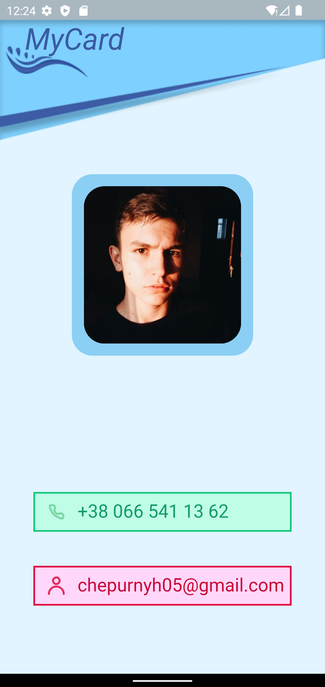
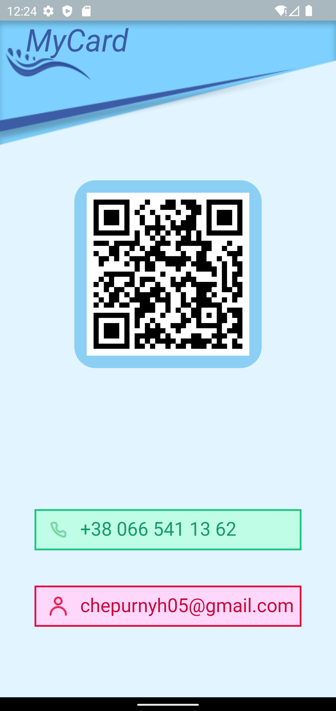

# Information card application

## Description
The application was created as a visiting card of the developer. When launching the application, the user sees a screen with information about the developer, such as phone number, email, and photo. When clicking on the photo, a flipper animation is performed and the user is presented with a QR-code that links to a LinkedIn account.

## How it looks

